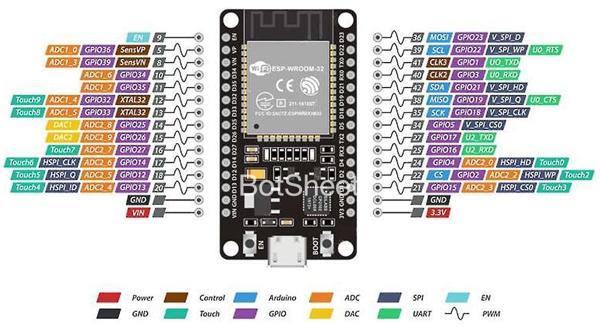
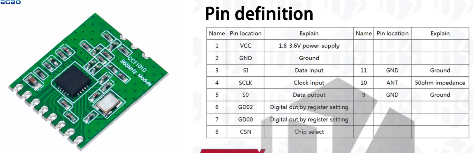
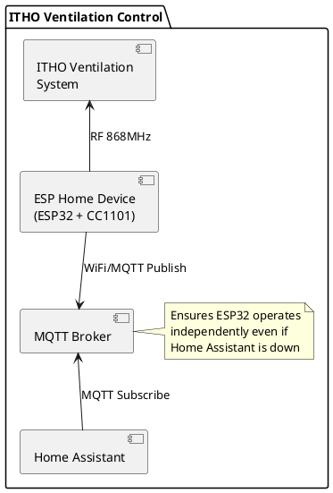

# ITHO Mechanical Ventilation Control

This project monitors and controls an ITHO mechanical ventilation system using an ESP32 with CC1101 RF transceiver and ESPHome firmware. The system can receive and decode RF commands from ITHO remotes and monitor the ventilation unit's status.

**Based on:**

- [ESPHome CC1101 Component](https://esphome.io/components/cc1101/) (official support since v2025.12)
- [ESPEasy IthoCC1101 Library](https://github.com/letscontrolit/ESPEasy/blob/mega/lib/Itho/IthoCC1101.cpp) for protocol implementation

## RF Configuration

The ITHO ventilation system uses the following RF parameters (derived from IthoCC1101.cpp):

| Parameter           | Value           | Notes                                  |
|---------------------|-----------------|----------------------------------------|
| Carrier frequency   | 868.2999 MHz    | ISM band                               |
| Modulation          | 2-FSK           | Frequency-shift keying                 |
| Symbol rate         | 38.383 kBaud    | MDMCFG4=0x5A, MDMCFG3=0x83             |
| Filter bandwidth    | ~203 kHz        | MDMCFG4=0x5A                           |
| Frequency deviation | 50 kHz          | DEVIATN=0x50                           |
| Sync word           | 0xB3 0x2A       | 16-bit sync (179, 42 decimal)          |
| Packet length       | 63 bytes        | Fixed length after sync word           |
| Preamble            | 7 bytes (0xAA)  | 6 auto (num_preamble: 3) + 1 manual    |
| CRC                 | Disabled        | No hardware CRC                        |
| Whitening           | Disabled        | Raw data                               |
| Encoding            | Manchester-like | Even bits extracted from 10-bit groups |

## Features

- **Receive RF commands** from ITHO remote controls (Low, Medium, High, Timer)
- **Timer countdown display** - Shows remaining time when timer mode is activated (10/20/30 minutes)
- **Remote ID whitelist** - Only accept commands from authorized remotes (security feature)
- **Transmit commands** to control ventilation speed (Low, Medium, High)
- **Pairing support** to register ESP32 as a remote control - **TODO: Not yet working, debugging needed!**
- **Monitor ventilation unit status** via hardwired switch position and actual fan speed
- **Real-time fan speed monitoring** - Displays current ventilation speed as percentage
- **MQTT integration** for standalone operation (works even when Home Assistant is down)
- **Over-the-air (OTA) updates** for firmware maintenance
- **Web interface** on port 80 for monitoring and diagnostics

## Hardware

This project is tested with the following ITHO equipment:

- **Ventilation Unit:** ITHO Daalderop CVE-S ECO
- **Original Remote:** ITHO RFT bedieningsschakelaar (RF remote control switch)
- **ESP32 Module:** ESP32 DevKit (ESP-WROOM-32)
- **RF Transceiver:** CC1101 868MHz module

The ESP32 with CC1101 acts as an additional remote control, allowing integration with Home Assistant while maintaining compatibility with the original ITHO remote.

## Pairing Process

To use the ESP32 as a remote control, you must first pair it with your ITHO ventilation unit:

1. **Put the ventilation unit in pairing mode:**
   - Turn the unit off at the breaker
   - Wait for 15 seconds
   - Turn it back on
   - For 2 minutes, the unit will be in pairing mode
   - *Note: Exact procedure varies by model - consult your unit's manual*

2. **Press the "Pair Remote" button** in Home Assistant or the web interface

3. **Wait for confirmation:**
   - The unit should shortly vary the fan speed to confirm pairing
   - Check the ESP32 logs for "Sending join command"
   - The device ID will be automatically generated from the ESP32 MAC address

4. **Test the pairing:**
   - Press "Low", "Medium", or "High" buttons
   - The ventilation speed should change accordingly

**Note:** The ESP32 will remember its device ID between reboots. If pairing fails, you may need to reset the ventilation unit and try again.

## Controlling the Ventilation

Once paired, use these buttons to control your ventilation:

- **Low** - Set fan to low speed
- **Medium** - Set fan to medium speed  
- **High** - Set fan to high speed

These buttons are available in:

- Home Assistant (as button entities)
- The ESP32 web interface (http://\[device-ip\])
- MQTT (publish to button topics)

### Timer Mode

When a Timer command is received from an ITHO remote control, the system:

1. Detects the timer duration (10, 20, or 30 minutes based on the command)
2. Starts a countdown timer displayed in the "Timer" text sensor
3. Shows remaining time in MM:SS format (e.g., "10:00", "5:30")
4. Automatically stops and displays "Off" when the timer expires
5. Timer is cancelled if a manual Low/Medium/High command is received

**Note:** Timer mode can only be activated by original ITHO remote controls that support timer functionality. The ESP32 currently only transmits Low/Medium/High commands.

## Remote ID Whitelist (Security)

The configuration includes a whitelist of authorized devices. This applies to both:

- **Remote controls** (e.g., bathroom wall switches)
- **Ventilation unit** (for status broadcasts)

Only packets from whitelisted devices will be processed. Configure the whitelist in two places:

**For status packets from the ventilation unit:**

```yaml
struct {
  uint8_t id[3];
  const char* room_name;
} allowed_remotes[] = {
  {{0x94, 0xD8, 0xF9}, "Ventilatie unit"},
};
```

**For remote controls:**

```yaml
struct {
  uint8_t id[3];
  const char* room_name;
} allowed_remotes[] = {
  {{0x51, 0x36, 0x35}, "Badkamer"},
  // Add more remotes here
};
```

To add a new device:

1. Monitor ESP32 logs while the device transmits
2. Look for warnings like:
   - `Ignored packet from unknown control unit: XX.XX.XX` (for ventilation unit)
   - `Ignored packet from unknown remote unit: XX.XX.XX` (for remote controls)
3. Add the device ID to the appropriate `allowed_remotes` array
4. Recompile and upload the firmware

This prevents unauthorized RF devices from controlling your ventilation system.

## Packet Format

### Remote Command Packets

Remote control commands are 63 bytes (raw) which decode to 24 bytes. The Manchester-like decoder starts from STARTBYTE=2 and extracts even bits (0, 2, 4, 6) from each 10-bit group.

**Command byte patterns at decoded bytes 5-10:**

| Command | Byte Pattern              | Notes                          |
|---------|---------------------------|--------------------------------|
| Low     | 22 F1 03 00 02 04         | Fixed low speed                |
| Medium  | 22 F1 03 00 03 04         | Fixed medium speed             |
| High    | 22 F1 03 00 04 04         | Fixed high speed               |
| Timer   | 22 F3 03 00 00 0A/14/1E   | Timed boost (10/20/30 minutes) |

Example decoded packet (High command):

```text
16.51.36.35.B9.22.F1.03.00.04.04.57.7F.FF...
              ^^^^^^^^^^^^^^^^
              Command bytes
```

### Status Packets

The ventilation unit broadcasts status messages showing actual fan speed:

**Format:** `1A.94.D8.F9.94.D8.F9.XX.31.D9.11.00.06.YY.00...`

- Byte 0: `0x1A` - Status message identifier
- Byte 7: Message counter (increments)
- Byte 12: `0x06` - Status message type
- Byte 13 (YY): Speed indicator:
  - `0x30-0x37` (48-55): Low speed (wired switch position 1)
  - `0x38-0x7F` (56-127): Medium speed (wired switch position 2 - auto mode)
  - `0x80+` (128+): High speed (wired switch position 3)
  - `0x11-0x1F`: Transient values during speed changes (ignored)

### Wired Switch Positions

The hardwired wall switch has three positions:

1. **Position 1:** Fixed low speed (`0x31` ≈ 49)
2. **Position 2:** Auto/sensing mode - runs at low speed baseline (`0x3C` ≈ 60), automatically increases with humidity
3. **Position 3:** Fixed high speed (`0xBF-0xC8` ≈ 191-200)

## Software Implementation

### ESPHome Configuration

The complete configuration is in [itho-ventilation.yaml](itho-ventilation.yaml) and includes:

1. **CC1101 Component** - Configures RF transceiver with ITHO-specific parameters
2. **Packet Decoder Lambda** - Implements Manchester-like decoding starting from STARTBYTE=2
3. **Command Detection** - Pattern matching for remote commands and status messages
4. **MQTT Integration** - Publishes state to Home Assistant via MQTT
5. **Text Sensors** - Exposes current command and last command states

### Key Implementation Details

**Manchester Decoder:**

- Processes 63-byte raw packets starting from byte 2 (STARTBYTE)
- Extracts even bits (0, 2, 4, 6) from each 10-bit group
- Produces 24-byte decoded packets

**Important:** The ITHO protocol uses a **custom Manchester-like encoding** that is incompatible with the CC1101's built-in `manchester` setting. Do not enable `manchester: true` in the cc1101 configuration - this will cause incorrect decoding. The ITHO encoding scheme inserts data bits at specific positions (0, 2, 4, 6) within 10-bit groups, which is different from standard Manchester encoding's simple bit transitions. Our custom decoder implementation is required for correct operation.

**Preamble Handling:** The CC1101 automatically adds 6 bytes via the `num_preamble: 3` setting, and we manually add 1 byte in the encoding for exactly 7 bytes total (exact ITHO specification compliance). This ensures maximum compatibility with the original ITHO protocol. Once transmission is confirmed working, we could simplify to `num_preamble: 4` (8 bytes automatic, no manual byte) since receivers typically tolerate one extra preamble byte.

**Command Detection Logic:**

```text
1. Check if status packet (byte[0]==0x1A && byte[12]==0x06)
   → Parse speed from byte[13]
2. Check if remote command (byte[5]==0x22 && byte[7]==0x03)
   → Timer: byte[6]==0xF3
   → Low/Med/High: byte[6]==0xF1, distinguished by byte[9]
```

**Home Assistant Integration:**

- Sensors:
  - `fan_speed` - Current fan speed percentage (0-100%)
  - `last_command` - Last received command (Low/Medium/High/Timer)
  - `controller_name` - Source of last command (e.g., "Badkamer" or "Ventilatie unit")
  - `timer` - Timer countdown display (MM:SS format, or "Off" when inactive)
- MQTT topics under `esp/` prefix
- State changes published immediately

## Hardware Components

### ESP32 Development Board



### Hardware Connections

| CC1101 Pin    | ESP32 Pin | Description                      |
|---------------|-----------|----------------------------------|
| 1 - VCC       | 3V3       | 3.3V power                       |
| 2 - GND       | GND       | Ground                           |
| 3 - MOSI      | GPIO23    | Data input to CC1101             |
| 4 - SCK       | GPIO18    | Clock pin                        |
| 5 - MISO/GDO1 | GPIO19    | Data output from CC1101          |
| 6 - GDO2      | GPIO4     | Programmable output (not used)   |
| 7 - GDO0      | GPIO16    | Packet ready interrupt           |
| 8 - CSN       | GPIO22    | Chip select (SPI_SS)             |

### CC1101 868MHz RF Module



**Specifications:**

- Multi-channel transceiver @ 868MHz ISM band
- Supports FSK, GFSK, ASK/OOK and MSK modulation
- Configurable data rate: 1.2k to 500kbps
- Independent 64-byte RX and TX data FIFOs
- Efficient SPI interface
- Low power supply (1.8V-3.6V)

### Architecture Diagram



## Future Enhancements

- **Timer button** - Add ability to transmit timer commands from ESP32 (currently only receives/displays timer from ITHO remotes)
- **Additional sensors** - Monitor air quality, humidity, and temperature  
- **Advanced automation** - Schedule ventilation based on time or sensor data
- **Energy monitoring** - Track power consumption
- **Enclosure design** - 3D-printed case for clean installation

## Known Limitations

- **Pairing not yet working** - The pairing sequence is implemented but doesn't successfully register with the ventilation unit. Needs debugging and finalize this feature
- **RF noise** - The receiver may pick up interference from nearby RF sources. Hardware filtering or antenna placement may help
- **Pairing procedure varies** - Different ITHO models have different pairing methods; consult your manual
- **Remote ID whitelist** - Must manually add new remote IDs to configuration
