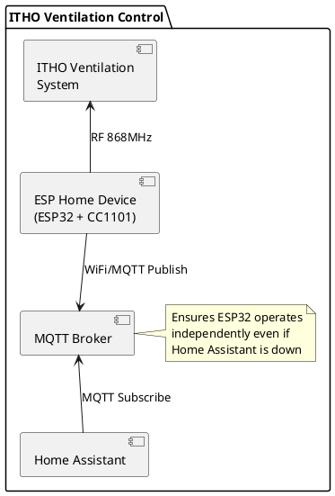

# ITHO Mechanical Ventilation Control

This project monitors and controls an ITHO mechanical ventilation system using an ESP32 with CC1101 RF transceiver and ESPHome firmware. The system can receive and decode RF commands from ITHO remotes and monitor the ventilation unit's status.

**Project Status:** ✅ **Fully Functional** - Pairing, command transmission (Low/Medium/High), and status monitoring are all working reliably.

**Based on:**

- [ESPHome CC1101 Component](https://esphome.io/components/cc1101/) (official support since v2025.12)
- [ESPEasy IthoCC1101 Library](https://github.com/letscontrolit/ESPEasy/blob/mega/lib/Itho/IthoCC1101.cpp) for protocol implementation

## RF Configuration

The ITHO ventilation system uses the following RF parameters (derived from IthoCC1101.cpp):

| Parameter           | Value           | Notes                                  |
|---------------------|-----------------|----------------------------------------|
| Carrier frequency   | 868.2999 MHz    | ISM band                               |
| Modulation          | 2-FSK           | Frequency-shift keying                 |
| Symbol rate         | 38.383 kBaud    | MDMCFG4=0x5A, MDMCFG3=0x83             |
| Filter bandwidth    | ~203 kHz        | MDMCFG4=0x5A                           |
| Frequency deviation | 50 kHz          | DEVIATN=0x50                           |
| Sync word           | 0xAB 0xFE       | 16-bit sync (171, 254 decimal)         |
| Packet length       | 63 bytes        | Fixed length; CC1101 strips sync word  |
| Preamble            | 8 bytes (0xAA)  | Auto-generated (num_preamble: 4)       |
| ITHO header         | 5 bytes         | 0x00 0xB3 0x2A 0xAB 0x2A (after sync)  |
| CRC                 | Disabled        | No hardware CRC                        |
| Whitening           | Disabled        | Raw data                               |
| Encoding            | Manchester-like | Even bits extracted from 10-bit groups |

## Multi-Device Configuration

This configuration is designed to be easily deployed across multiple ESP32 devices. The YAML file uses ESPHome substitutions to prefix all entity IDs, preventing conflicts in Home Assistant.

**To use this configuration on multiple devices:**

1. Copy the entire YAML file
2. Update the **device-specific section** at the top (everything before the `globals:` section):
   - `substitutions.device_name` - Unique hostname (e.g., `itho-kitchen`, `itho-bathroom`)
     - **Must use hyphens only** (no underscores) per RFC hostname standards
   - `substitutions.device_prefix` - Unique prefix for entity IDs (e.g., `itho_kitchen`, `itho_bathroom`)
     - **Must use underscores** to match the device_name but with underscores instead of hyphens
   - `esphome.friendly_name` - Human-readable name
   - GPIO pins if your wiring differs
   - MQTT log topic if desired
3. The **shared configuration** (from `globals:` to the end) can be copied as-is

**Example for a second device:**

```yaml
substitutions:
  device_name: itho-bathroom          # Hyphens for hostname
  device_prefix: itho_bathroom        # Underscores for IDs

esphome:
  name: ${device_name}
  friendly_name: ITHO Bathroom Ventilation
  # ... rest of device-specific config
```

All sensors, buttons, and scripts will automatically use the prefix, creating unique entity IDs like:

- `itho_bathroom_fan_speed`
- `itho_bathroom_last_command`
- `itho_bathroom_send_command`

This ensures multiple devices can coexist in Home Assistant without ID conflicts.

## Features

### ✅ Fully Working

- **Receive RF commands** from ITHO remote controls (Low, Medium, High, Timer)
- **Timer countdown display** - Shows remaining time when timer mode is activated (10/20/30 minutes)
- **Remote ID whitelist** - Only accept commands from authorized remotes (security feature)
- **Transmit commands** to control ventilation speed (Low, Medium, High) - each command is transmitted exactly 3 times with 40ms delay between transmissions
- **Pairing support** - Register ESP32 as a remote control with Join command (3 transmissions) and Leave command (30 transmissions with 4ms delay between each, plus transmission overhead - approximately 1 second total per ITHO specification)
- **Monitor ventilation unit status** via hardwired switch position and actual fan speed
- **Real-time fan speed monitoring** - Displays current ventilation speed as percentage
- **Humidity monitoring** - Receives and displays humidity measurements from ventilation unit broadcasts (unit periodically transmits this data)
- **MQTT integration** for standalone operation (works even when Home Assistant is down)
- **Over-the-air (OTA) updates** for firmware maintenance
- **Web interface** on port 80 for monitoring and diagnostics
- **Debug logging** - Unknown ITHO messages are captured for analysis and protocol development

### 🔄 Future Enhancements

- **Timer transmission** - Currently only receives/displays timer commands; cannot transmit them yet

## Hardware

This project is tested with the following ITHO equipment:

- **Ventilation Unit:** ITHO Daalderop CVE-S ECO
- **Original Remote:** ITHO RFT bedieningsschakelaar (RF remote control switch)
- **ESP32 Module:** ESP32 DevKit (ESP-WROOM-32)
- **RF Transceiver:** CC1101 868MHz module

The ESP32 with CC1101 acts as an additional remote control, allowing integration with Home Assistant while maintaining compatibility with the original ITHO remote.

## Pairing Process

To use the ESP32 as a remote control, you must first pair it with your ITHO ventilation unit:

1. **Put the ventilation unit in pairing mode:**
   - Turn the unit off at the breaker
   - Wait for 15 seconds
   - Turn it back on
   - For 2 minutes, the unit will be in pairing mode
   - *Note: Exact procedure varies by model - consult your unit's manual*

2. **Press the "Pair Remote" button** in Home Assistant or the web interface

3. **Wait for confirmation:**
   - The unit should shortly vary the fan speed to confirm pairing
   - Check the ESP32 logs for "Sending Join command (counter=X)"
   - The device ID is automatically generated from the last 3 bytes of the ESP32 MAC address
   - The join packet is transmitted 3 times with 40ms delay between transmissions

4. **Test the pairing:**
   - Press "Low", "Medium", or "High" buttons
   - The ventilation speed should change accordingly
   - Each command is transmitted exactly 3 times to ensure reliable reception

**Success indicators:**

- The ventilation unit will briefly change fan speeds (usually a quick ramp up/down) to acknowledge successful pairing
- After pairing, all speed control commands (Low/Medium/High) should work reliably
- The ESP32 logs will show "Sending Join command (counter=X)" followed by the encoded packet

**Notes:**

- The ESP32 remembers its device ID and packet counter between reboots
- The packet counter increments with each command to prevent replay attacks
- The device ID is derived from the last 3 bytes of the ESP32's MAC address, ensuring uniqueness
- If pairing fails, verify the unit is in pairing mode and try again within the 2-minute window

## Controlling the Ventilation

Once paired, use these buttons to control your ventilation:

- **Low** - Set fan to low speed
- **Medium** - Set fan to medium speed  
- **High** - Set fan to high speed

These buttons are available in:

- Home Assistant (as button entities)
- The ESP32 web interface (http://\[device-ip\])
- MQTT (publish to button topics)

### Timer Mode

When a Timer command is received from an ITHO remote control, the system:

1. Detects the timer duration (10, 20, or 30 minutes based on the command)
2. Starts a countdown timer displayed in the "Timer" text sensor
3. Shows remaining time in MM:SS format (e.g., "10:00", "5:30")
4. Automatically stops and displays "Off" when the timer expires
5. Timer is cancelled if a manual Low/Medium/High command is received

**Note:** Timer mode can only be activated by original ITHO remote controls that support timer functionality. The ESP32 currently only transmits Low/Medium/High commands.

## Remote ID Whitelist (Security)

The configuration includes a whitelist of authorized devices. This applies to both:

- **Remote controls** (e.g., bathroom wall switches)
- **Ventilation unit** (for status broadcasts)

Only packets from whitelisted devices will be processed. The whitelist is configured in the **device-specific section** at the top of the YAML file using `std::vector<std::string>` globals:

**For status packets from the ventilation unit:**

```yaml
globals:
  - id: allowed_units_config
    type: std::vector<std::string>
    restore_value: no
    initial_value: '{"94.D8.F9 Ventilatie unit"}'
```

**For remote controls:**

```yaml
globals:
  - id: allowed_remotes_config
    type: std::vector<std::string>
    restore_value: no
    initial_value: '{"51.36.35 Badkamer", "5F.53.40 Home assistant", "A8.86.D4 ESP test remote"}'
```

**Format:** Each entry is `"XX.YY.ZZ Device Name"` where:

- `XX.YY.ZZ` is the 3-byte device ID in hexadecimal format (with periods)
- Device Name is a descriptive label (everything after the first space)

**To add a new device:**

1. Monitor ESP32 logs while the device transmits
2. Look for warnings like:
   - `Ignored packet from unknown ventilation unit: XX.YY.ZZ`
   - `Ignored packet from unknown remote: XX.YY.ZZ`
3. Add the device ID to the appropriate vector in the globals section:

   ```yaml
   initial_value: '{"51.36.35 Badkamer", "5F.53.40 Home assistant", "A8.86.D4 ESP test remote", "XX.YY.ZZ New Device"}'
   ```

4. Recompile and upload the firmware

**Advantages of this approach:**

- No C++ code modification needed - just edit the YAML configuration
- Easy to add/remove devices without understanding lambda functions
- Device names are displayed in logs for easier troubleshooting
- All device-specific configuration is in one place at the top of the file

This prevents unauthorized RF devices from controlling your ventilation system.

## Packet Format

### Remote Command Packets

Remote control commands are 63 bytes (raw) which decode to approximately 24 bytes. The Manchester-like decoder starts from STARTBYTE=5 (after the 5-byte ITHO header) and extracts even bits (0, 2, 4, 6) from each 10-bit group.

**Command byte patterns at decoded bytes 5-10:**

| Command | Byte Pattern              | Notes                          |
|---------|---------------------------|--------------------------------|
| Low     | 22 F1 03 00 02 04         | Fixed low speed                |
| Medium  | 22 F1 03 00 03 04         | Fixed medium speed             |
| High    | 22 F1 03 00 04 04         | Fixed high speed               |
| Timer   | 22 F3 03 00 00 0A/14/1E   | Timed boost (10/20/30 minutes) |

Example decoded packet (High command):

```text
16.51.36.35.B9.22.F1.03.00.04.04.57.7F.FF...
              ^^^^^^^^^^^^^^^^
              Command bytes
```

### Status Packets

The ventilation unit broadcasts two types of status messages:

#### Fan Speed Status

**Format:** `1A.94.D8.F9.94.D8.F9.XX.31.D9.11.00.06.YY.00...`

- Byte 0: `0x1A` - Status message identifier
- Byte 7: Message counter (increments)
- Byte 12: `0x06` - Speed status message type
- Byte 13 (YY): Speed indicator:
  - `0x30-0x37` (48-55): Low speed (wired switch position 1)
  - `0x38-0x7F` (56-127): Medium speed (wired switch position 2 - auto mode)
  - `0x80+` (128+): High speed (wired switch position 3)
  - `0x11-0x1F`: Transient values during speed changes (ignored)

#### Humidity Status

**Format:** `18.94.D8.F9.94.D8.F9.31.DA.1D.00.EF.00.7F.FF.3A.YY....`

- Byte 0: `0x18` - Humidity message identifier
- Bytes 1-3: Device ID (e.g., `94.D8.F9` for ventilation unit)
- Byte 12: `0x00` - Humidity status message type
- Byte 15 (YY): Relative humidity percentage (0-100)

The ventilation unit periodically broadcasts humidity readings from its internal sensor.

### Wired Switch Positions

The hardwired wall switch has three positions:

1. **Position 1:** Fixed low speed (`0x31` ≈ 49)
2. **Position 2:** Auto/sensing mode - runs at low speed baseline (`0x3C` ≈ 60), automatically increases with humidity
3. **Position 3:** Fixed high speed (`0xBF-0xC8` ≈ 191-200)

## Software Implementation

### ESPHome Configuration

The complete configuration is in [itho-ventilation.yaml](itho-ventilation.yaml) and includes:

1. **CC1101 Component** - Configures RF transceiver with ITHO-specific parameters
2. **Packet Decoder Lambda** - Implements Manchester-like decoding starting from STARTBYTE=5 (after 5-byte ITHO header)
3. **Manchester Encoder Lambda** - Encodes payload data with ITHO's custom Manchester-like encoding for transmission
4. **Command Detection** - Pattern matching for remote commands and status messages
5. **Queued Transmission System** - Ensures reliable command delivery with configurable repeat count and delay
6. **MQTT Integration** - Publishes state to Home Assistant via MQTT
7. **Text Sensors** - Exposes current command, control source, and timer countdown

### Key Implementation Details

**Manchester Decoder:**

- Processes 63-byte raw packets starting from byte 5 (STARTBYTE, after 5-byte ITHO header)
- Extracts even bits (0, 2, 4, 6) from each 10-bit group
- Produces approximately 24-byte decoded packets (up to 32 bytes buffer)

**Important:** The ITHO protocol uses a **custom Manchester-like encoding** that is incompatible with the CC1101's built-in `manchester` setting. Do not enable `manchester: true` in the cc1101 configuration - this will cause incorrect decoding. The ITHO encoding scheme inserts data bits at specific positions (0, 2, 4, 6) within 10-bit groups, which is different from standard Manchester encoding's simple bit transitions. Our custom decoder implementation is required for correct operation.

**Preamble Handling:** The CC1101 automatically adds 8 bytes via the `num_preamble: 4` setting. While the original ITHO specification calls for 7 bytes, receivers typically tolerate one extra preamble byte without issues.

**Transmission System:**

The implementation uses a queued script architecture to ensure reliable command delivery:

1. **send_payload** - Encodes the command payload using ITHO's Manchester-like encoding into a 63-byte packet stored in a `std::vector<uint8_t>`
2. **send_packet_data** - Queued script that transmits the packet, waits for the specified delay, then recursively queues the next transmission
3. **Memory Safety** - Using `std::vector` as a parameter ensures the packet data is copied by value for each queued execution, preventing use-after-free bugs

Transmission parameters:

- **Standard commands** (Low/Medium/High): 3 transmissions with 40ms delay
- **Join command**: 3 transmissions with 40ms delay
- **Leave command**: 30 transmissions with 4ms delay (approximately 1 second total)

The `transmit_count` parameter specifies exactly how many times to send the packet - not how many repeats after the first transmission.

**Command Detection Logic:**

```text
1. Validate minimum decoded packet length (≥14 bytes)
2. Check if humidity packet (byte[0]==0x18 && byte[12]==0x00)
   → Verify device ID against unit whitelist (bytes[1-3])
   → Parse humidity from byte[15] (0-100%)
   → Update humidity sensor
3. Check if speed status packet (byte[0]==0x1A && byte[12]==0x06)
   → Verify device ID against unit whitelist (bytes[1-3])
   → Parse speed from byte[13]
   → Update fan_speed sensor with percentage (0x00-0xC8(=200) mapped to 0-100%)
   → Clear last_command if speed no longer matches
4. Check if remote command (byte[5]==0x22 && byte[7]==0x03)
   → Verify device ID against remote whitelist (bytes[1-3])
   → Timer: byte[6]==0xF3, extract duration from byte[10] (0x0A/0x14/0x1E)
   → Low/Med/High: byte[6]==0xF1, distinguished by byte[9] (0x02/0x03/0x04)
   → Update controller_name and last_command sensors
5. Unknown packets → Logged to unknown_message sensor for debugging
```

**Packet Counter:** Each transmitted command includes a counter value (byte[4]) that increments with each button press. This counter is persisted across reboots and helps the ventilation unit detect duplicate packets.

**Home Assistant Integration:**

- Sensors:
  - `fan_speed` - Current fan speed percentage (0-100%)
  - `humidity` - Relative humidity percentage from ventilation unit
  - `uptime` - Device uptime in seconds
  - `wifi_signal` - WiFi signal strength
- Text Sensors:
  - `last_command` - Last received command (Low/Medium/High/Timer)
  - `controller_name` - Source of last command (e.g., "Badkamer" or "Ventilatie unit")
  - `timer` - Timer countdown display (MM:SS format, or "Off" when inactive)
  - `unknown_message` - Debug sensor showing unrecognized ITHO packets
- MQTT topics under `esp/` prefix
- State changes published immediately
- Logger level set to INFO for production use (change to DEBUG for troubleshooting)

## Hardware Components

### ESP32 Development Board


### Hardware Connections

| CC1101 Pin    | ESP32 Pin | Description                      |
|---------------|-----------|----------------------------------|
| 1 - VCC       | 3V3       | 3.3V power                       |
| 2 - GND       | GND       | Ground                           |
| 3 - MOSI      | GPIO23    | Data input to CC1101             |
| 4 - SCK       | GPIO18    | Clock pin                        |
| 5 - MISO/GDO1 | GPIO19    | Data output from CC1101          |
| 6 - GDO2      | GPIO4     | Programmable output (not used)   |
| 7 - GDO0      | GPIO16    | Packet ready interrupt           |
| 8 - CSN       | GPIO22    | Chip select (SPI_SS)             |

### CC1101 868MHz RF Module


**Specifications:**

- Multi-channel transceiver @ 868MHz ISM band
- Supports FSK, GFSK, ASK/OOK and MSK modulation
- Configurable data rate: 1.2k to 500kbps
- Independent 64-byte RX and TX data FIFOs
- Efficient SPI interface
- Low power supply (1.8V-3.6V)

### Architecture Diagram



## Future Enhancements

- **Timer button** - Add ability to transmit timer commands from ESP32 (currently only receives/displays timer from ITHO remotes)
- **Additional sensors** - Monitor air quality, humidity, and temperature  
- **Advanced automation** - Schedule ventilation based on time or sensor data
- **Energy monitoring** - Track power consumption
- **Enclosure design** - 3D-printed case for clean installation

## MQTT Configuration

### ESP-IDF Framework Considerations

This project uses the ESP-IDF framework (not Arduino), which requires specific MQTT settings for stable operation:

```yaml
mqtt:
  broker: !secret mqtt_broker
  username: !secret mqtt_username
  password: !secret mqtt_password
  log_topic: esp/logs/${device_name}
  idf_send_async: false  # Important for ESP-IDF: send messages synchronously
```

**Key setting:** `idf_send_async: false` ensures MQTT messages are sent synchronously, preventing the message queue from overwhelming the broker during the initial connection burst when the device publishes all its discovery and state messages.

### Mosquitto Broker Configuration

If using Mosquitto broker (v2.0+), you may need to adjust the receive maximum limit to prevent disconnections:

**Symptom:** Device repeatedly connects and disconnects every ~10 seconds with errors like:

- Broker logs: `Client disconnected due to exceeding the receive maximum`
- ESP logs: `Last error code reported from esp-tls: 0x8008`, `TCP disconnected`

**Solution:** Add to your `mosquitto.conf`:

```conf
max_inflight_messages 100
# Or disable the limit entirely:
# max_inflight_messages 0
```

Then restart mosquitto: `sudo systemctl restart mosquitto`

**Explanation:** MQTT 5.0 introduced a "Receive Maximum" property that limits how many QoS > 0 messages can be in-flight. ESPHome devices can exceed the default limit (typically 20) during initial connection when publishing all their discovery messages and retained states. Setting this to 100 or 0 (unlimited) prevents the broker from forcibly disconnecting the client.

## Known Limitations

- **RF noise** - The receiver may pick up interference from nearby RF sources. Hardware filtering or antenna placement may help. Non-ITHO packets with RSSI < -90 dBm are silently ignored.
- **Pairing procedure varies** - Different ITHO models have different pairing methods; consult your unit's manual for specific instructions
- **Remote ID whitelist** - Must manually add new remote IDs to configuration and recompile firmware (device IDs are logged when unknown devices transmit)
- **Timer transmission** - The ESP32 can only receive and display timer commands from original ITHO remotes. It cannot yet transmit timer commands (only Low/Medium/High and Join/Leave are supported).
- **Model compatibility** - Tested with ITHO Daalderop CVE-S ECO; other models may require timing or encoding adjustments
